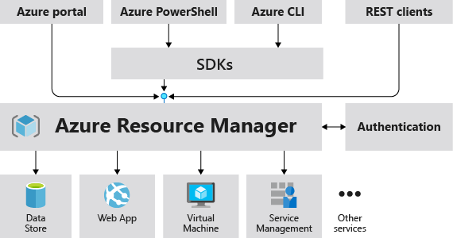

# Implement infrastructure as a service (IaaS) solutions

## Provision Virtual Machines (VMs)
With Azure VM, Microsoft offers a virtual computer with both Linux and Windows operating systems, without buying and maintaining the physical hardware.Typically, you choose a VM when you need more control over the computing environment than the other choices (e.g. Azure App Service) offer.

### Basic components for crating an Azure VM:
- **Availability:** Provides a Service Level Agreements (SLA) of 99,9% with a Premium Storage.
- **VM size:** Determining the sizing of the VM based on running workload on it. [There are several VM sizes for different scenarios](https://docs.microsoft.com/en-us/azure/virtual-machines/sizes). The size of the VM determines the capacity of the CPU, RAM, etc., and also affects the price of the VM. If you stop and deallocate the VM, then you can change the size of the VM.
- **VM limits:** Each subscription has a limit of 20 VMs per region, [but this can be increased on request via the Azure support](https://docs.microsoft.com/en-us/azure/azure-portal/supportability/regional-quota-requests).
- **VM image:** Choose an image from Azure Marketplace or bring your own image for creating a VM. You can lis all available VM images in Azure via _az command list --all_. [The List of popular images in Azure Marketplace] (https://docs.microsoft.com/en-us/azure/virtual-machines/linux/cli-ps-findimage#list-popular-images)
- **VM disks:** Here are 2 components to be considerd:
  - **Disk types:**:
    - **Standard disks:** HDD disks, which delivers cost-effective storage and are ideal for a dev and test workload.
    - **Premium disks:** SSD disks, which provides high-performance, low-latency disk and are ideal for VMs running production workload.
  - **Dsik stoarge options:**
    - **Managed disks:** Recommended disk storage and they are managed by Azure. You specify the size of the disk, which can be up to 4 TB, and Azure creates and manages both the disk and the storage. You don't have to worry about storage account limits, which makes managed disks easier to scale out than unmanaged disks.
    - **Unmanaged disks:** You’re responsible for the storage accounts that hold the virtual hard disks (VHDs) that correspond to your VM disks. You pay the storage account rates for the amount of space you use. A single storage account has a fixed-rate limit of 20,000 I/O operations per second. This means that a storage account is capable of supporting 40 standard VHDs at full utilization. If you need to scale out with more disks, then you'll need more storage accounts, which can get complicated.

### Azure VM availability options
There are basicly 3 types of availabillty options for ensuring the availability of the VMs, or workloads that run in VMs.
-**Availability Zones (AZs):** Are physicaly seperated zones within an Azure region. Each supported region contains 3 AZs. Azure services that support AZs fall into two categories:
  - **Zonal services:** A resource is pinned to a specific zone (e.g. IP adreesses).
  - **Zone-redundant services:** Azure replicates the resource automitically across zones (e.g. zone-redundant storage).

- **Availability sets:** Are Logical grouping of VMs that allows Azure to understand how your application is built to provide for redundancy and availability. An availability set is composed of 2 groupings that protect against hardware failures (Fault Domains) and allow updates to safely be applied (Update Domains):
  - **Fault Domains (FD):** Is a logical group of underlying hardware that share a common power source and network switch. As you create VMs within an availability set, the Azure platform automatically distributes your VMs across these FDs. This approach limits the impact of potential physical hardware failures, network outages, or power interruptions.
  - **Update Domains (UD):** Is a logical group of underlying hardware that can undergo maintenance or be rebooted at the same time. As you create VMs within an availability set, the Azure platform automatically distributes your VMs across these update domains. This approach ensures that at least one instance of your application always remains running as the Azure platform undergoes periodic maintenance.

- **VM scale sets:** Provides a group of load balanced VMs, which the number of VM instances can automatically increase or decrease based on demand or a defined schedule. Load balancer task is distributeing incoming traffic among healthy VMs.

### Create some Azure VMs with Azure CLI:
You can create an Azure VM via Azure Portal, with Azure CLI, Azure PowerShell, and many Infrastructure as Code (IaC) frameworks (e.g. ARM templates, Bicep, Terraform, etc.)

Create a Windows Server 2022 Data Center with Azure CLI:
```
az vm create \
    --resource-group rg-az204 \
    --locatio northeurope \
    --name testVM-az204 \
    --image Win2022Datacenter \
    --admin-username az204-user
```

Create a Ubuntu Linux with Azure CLI:
```
az vm create \
    --resource-group rg-az204 \
    --name vm-testUbuntu \
    --image UbuntuLTS \
    --generate-ssh-keys \
    --admin-username vm-testuser
```


## Create and deploy Azure Resource Manager (ARM) templates
Azure ARM is the deployment and management service for provisioning, updating, deleting, and managing Azure resources in a subscription. No matter if you're using the Portal or Azure CLI, PowerShell, or any Infrastructure as Code (IaC) framework all of them going to communicate with ARM to provision, update, and mange resources in Azure.



Azure ARM template is a JSON based template, which is used for creating and managing any kind of resources in Azure in a declarative and automation way, rathar than manuel via Portal.

An ARM template has basicly following components:
- **Parameters:** Provide values during deployment that allow the same template to be used with different environments. Parameters are used commonly for changed configuration elements e.g VM names, VNET names, storage account names, etc.
- **Variables:** Define values that are reused in your templates. They can be constructed from parameter values.
- **functions:** Create customized functions that simplify your template.
- **Resources:** Specify the resources to deploy, e.g. VM, VNET, etc.
- **Outputs:** Return values from the deployed resources, e.g. storage account ID.

You can find dozen of ARM templates examples and quickstart templates on [Azure Quickstart Templates](https://github.com/Azure/azure-quickstart-templates) GitHub.

You can share your template with other users or within an organization using [Template specs](https://docs.microsoft.com/en-us/azure/azure-resource-manager/templates/template-specs?tabs=azure-powershell) and store your templates as a resource type.

## Manages container images in Azure Container Registry (ACR)
ACR is a managed and private Docker registry service based on open-source Docker Registry 2.0 for storing and managing  container images. This service can be used either for existing container development and deployment pipelines, or to build container images in Azure.
ACR can include both Windows and Linux images. In addition to Docker container images, ACR stores related content formats such as Helm charts and images built to the Open Container Initiative (OCI) Image Format Specification.

### ACR service tiers:
- **Basic:** A cost-optimized tier with the same capabilities like Standard abd Premium, but with lower storage and image throughput. Suitable for dev, test, and learning scenarios.
- **Standard:** Same capabilities as Basic, with increased storage and image throughput. Suitable for the most  production scenarios.
- **Premium:** Provides the highest amount of storage and concurrent operations, enabling high-volume scenarios. In addition to higher image throughput, Premium adds features such as geo-replication for managing a single registry across multiple regions, content trust for image tag signing, and private link with private endpoints to restrict access to the registry.

### Create an ACR with Azure CLI:
```
Create an ACR with Azure CLI:
az acr create \
    --resource-group rg-az204 \
    --name acrtestaz204 \
    --sku Basic
```

#### Create a Dockerfile for a sample hello-world image
```
echo FROM mcr.microsoft.com/hello-world > Dockerfile
```

#### Push the sample hello-world image to the created ACR
```
az acr build --image sample/hello-world:v1 \
    --registry acrtestaz204 \
    --file Dockerfile .
```

### Create an ACR with Terraform
[Terraform](Terraform/main.tf)


## Run container images in Azure Container Instances (ACI)

